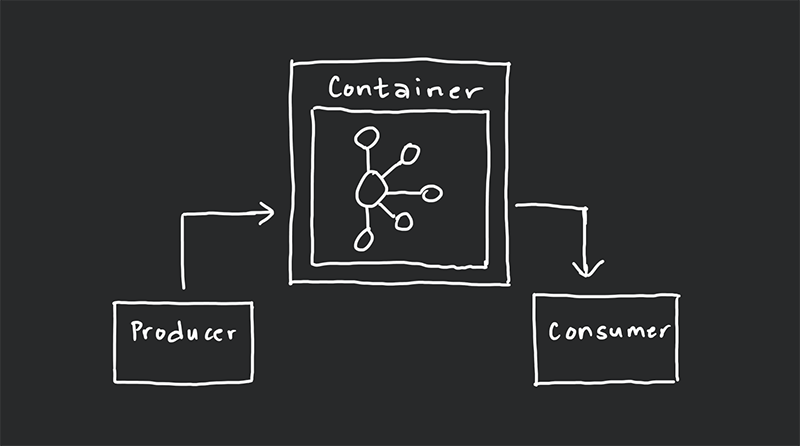

# Kafka Local Setup

This is my simple setup of Kafka (from Confluent Inc.) instance using Docker as a serving container. This includes sample codes for producer and consumer made both in Node.js. I am integrating this with system that has use case of event-streaming in local development.

## Flow Diagram

## Technologies and Libraries

- Node.js
- [node-rdkafka](https://www.npmjs.com/package/node-rdkafka)
- [Docker](https://docs.docker.com/desktop)